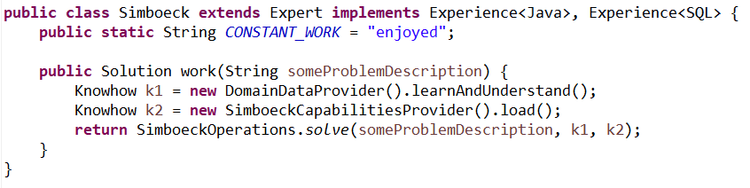

## Simböck IT Beratung

Sie brauchen Hilfe bei der Fehlersuche oder bei Optimierungen, oder sie wollen ein Projekt starten, ich helfe gerne und löse Ihre Probleme.

### Java-Erfahrung
- seit 19 Jahren
- in J2EE-Projekten 
- in Web-Projekten 
- in Swing-Client-Projekten
- Eclipse-RCP-Projekten

### Projekt-Erfahrungen seit 23 Jahren

Ich weiß wie Zusammenarbeit funktioniert, wie man gut kleine Teams führen kann. Und ich freue mich gemeinsam Lösungen zu gestalten und zu implementieren. Als sehr hilfteich erachte ich dabei ein agiles Vorgehen und CleanCodeDesign.

### Kontakt

