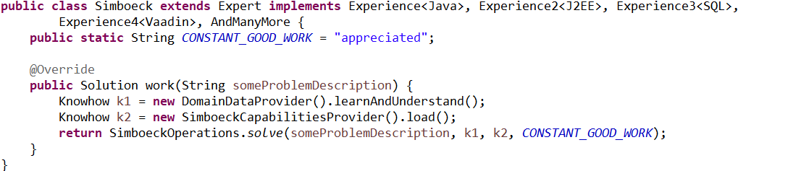

## Simböck IT Beratung

### Java-Erfahrung
- seit 19 Jahren
- in J2EE-Projekten 
- in Web-Projekten 
- in Swing-Client-Projekten
- Eclipse-RCP-Projekten

### Projekt-Erfahrungen seit 23 Jahren

Ich weiß wie Zusammenarbeit funktioniert, wie gut man kleine Teams führen kann. Und ich freue mich gemeinsam Lösungen zu gestalten und zu implementieren. Als sehr hilfteich erachte ich dabei ein agiles Vorgehen und CleanCodeDesign.

### Lösungen

Inventur: Sie suchen eine einfache Software um eine Inventur durchzuführen. Server-Software um Bestandsdaten zu laden, zu verwalten, um Labels zu drucken und Ergebnisse auszuwerten. Android-Basierende Clients um schnell die Labels zu erfassen (Barcode oder RFID), so ist ein Zählung ohne viel Aufwand erledigt.
Für mehr Details siehe [Inventur Solution](http://chief-ernie.de/).

